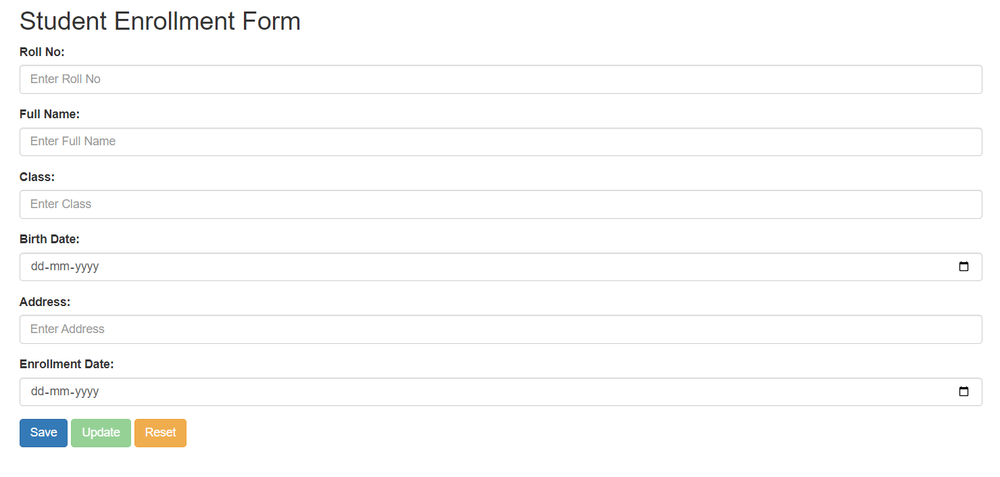

# Database-form-based-on-jsonpowerDB
# Student Enrollment System with JsonPowerDB

## Description

This project implements a Student Enrollment System using JsonPowerDB as the backend database. The system allows users to manage student records, including Roll No, Full Name, Class, Birth Date, Address, and Enrollment Date.

## Benefits of using JsonPowerDB

JsonPowerDB is a NoSQL database that provides several advantages for this project:

- **Schema-free:** Allows flexibility in defining the structure of student records.
- **Lightweight and fast:** Offers quick response times for read and write operations.
- **Easy to use:** Simple and intuitive APIs for database operations.

## Release History

- **v1.0 (February 2024):** Initial release with basic CRUD functionality.

## Table of Contents

1. [Description](#description)
2. [Benefits of using JsonPowerDB](#benefits-of-using-jsonpowerdb)
3. [Release History](#release-history)
4. [Table of Contents](#table-of-contents)
5. [Illustrations](#illustrations)
6. [Scope of Functionalities](#scope-of-functionalities)
7. [Examples of Use](#examples-of-use)
8. [Project Status](#project-status)
9. [Sources](#sources)
10. [Other Information](#other-information)

## Illustrations


*Caption: Student Enrollment Form*

## Scope of Functionalities

- **Data Entry:** Users can enter student information through a user-friendly form.
- **Data Retrieval:** Retrieve and display student records from the JsonPowerDB database.
- **Data Update:** Update existing records, ensuring data accuracy.
- **Data Deletion:** Remove student records when necessary.

## Examples of Use

### 1. Data Entry
```javascript
// JavaScript code
function saveOrUpdateData() {
            var jsonStr = validateAndGetFormData();
            if (!jsonStr) {
                return;
            }
            else {

                var rollNoVar = $("#rollNo").val();

                // Check if Roll No already exists in the database
                var getRequestStr = createGETRequest("90931755|-31949307695292705|90963411", "SCHOOL-DB", "STUDENT-TABLE", rollNoVar, "RollNo");
                var getResult = executeCommandAtGivenBaseUrl(getRequestStr, "http://api.login2explore.com:5577", "/api/irl");

                if (getResult && getResult.data && getResult.data.length > 0) {
                    // Existing record found, update the record
                    var updateReqStr = createUpdateRequest("90931755|-31949307695292705|90963411", "SCHOOL-DB", "STUDENT-TABLE", rollNoVar, "RollNo", jsonStr);
                    var updateResult = executeCommandAtGivenBaseUrl(updateReqStr, "http://api.login2explore.com:5577", "/api/iml");

                    if (updateResult && updateResult.response && updateResult.response.update) {
                        alert("Record updated successfully!");
                        resetForm();
                        enableButtonsForSave(); // Enable Save button for future entries
                    } else {
                        alert("Error: Unable to update the record. Please check the console for details.");
                        console.error("Error details:", updateResult);
                    }
                } else {
                    // No existing record found, insert a new record
                    var putReqStr = createPUTRequest("90931755|-31949307695292705|90963411", jsonStr, "SCHOOL-DB", "STUDENT-TABLE");
                    var putResult = executeCommandAtGivenBaseUrl(putReqStr, "http://api.login2explore.com:5577", "/api/iml");

                    if (putResult && putResult.response && putResult.response.insert) {
                        alert("Record inserted successfully!");
                        resetForm();
                    } else {
                        alert("Error: Unable to insert the record. Please check the console for details.");
                        console.error("Error details:", putResult);
                    }
                }
            }
        }

//End of the snippet
```
## Project Status
This project is currently in its initial stage (v1.0) with basic functionality. Further enhancements and features may be added in future releases.

## Sources
JsonPowerDB Documentation

## Other Information
Feel free to contribute to the project by submitting bug reports, feature requests, or pull requests. Your feedback is valuable!
